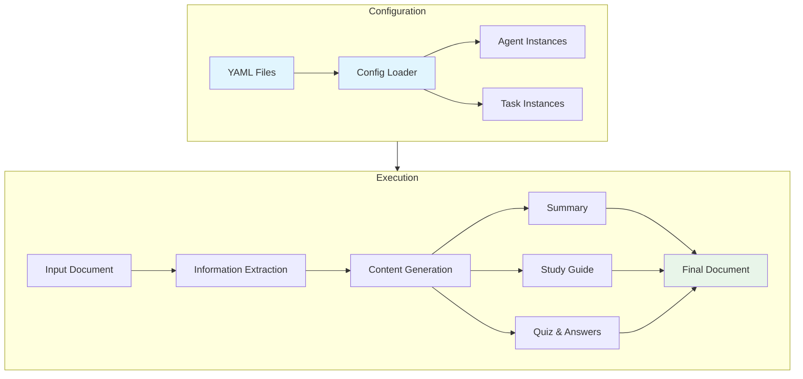

# Document to Quiz Generator via CrewAI

## Overview
This educational project is designed to transform documents into interactive quizzes, helping learners engage with and retain information more effectively. It uses a YAML-based configuration system for easy customization of agents and tasks.

## Features
- Convert text documents into quiz-style questions
- Generate multiple-choice and open-ended questions
- Support for various document formats
- YAML-based configuration for easy customization
- Modular architecture with separate configuration and code
- Automatic generation of summaries and study guides

## Project Structure
```
docs_to_quiz/
├── configs/
│   ├── agents.yaml     # Agent configurations
│   ├── tasks.yaml      # Task configurations
│   ├── config_loader.py # Configuration loading utilities
│   └── models.py       # Pydantic data models
├── input/              # Input documents
│   └── doc_02_flow_content.md
├── output/            # Generated content
│   ├── summary.md
│   ├── study_guide.md
│   ├── quiz_questions.md
│   ├── quiz_answers.md
│   └── combined_output.md
├── script_01.py       # Main execution script
└── README.md
```

## System Architecture



## Requirements

### Python Dependencies
The project uses the following key dependencies:
- `crewai`: AI agent framework for orchestrating tasks
- `pydantic`: Data validation using Python type annotations
- `PyYAML`: YAML file parsing and loading
- `openlit`: Observability and monitoring

To install dependencies, run:
```bash
pip install -r requirements.txt
```

## Configuration

### LLM Configuration
Configure different LLM models for different agents:
```yaml
llm_configs:
  gemini_pro:
    model: "openrouter/google/gemini-pro-1.5"
    temperature: 0.7
  
  gpt4:
    model: "openai/gpt-4"
    temperature: 0.5
    
  gpt35_turbo:
    model: "openai/gpt-3.5-turbo"
    temperature: 0.3
```

### Agent Configuration (agents.yaml)
Configure AI agents with specific roles, capabilities, and LLM preferences:
```yaml
extract_agent:
  role: "Information Extractor"
  goal: "To analyze documents and extract key information"
  backstory: "A seasoned researcher with an eye for detail..."
  llm: gemini_pro  # Use Gemini Pro for extraction

writer_agent:
  role: "Content Writer and Educator"
  goal: "To create clear summaries and engaging quizzes"
  backstory: "A skilled educator with expertise..."
  llm: gpt4  # Use GPT-4 for content generation
```

### Task Configuration (tasks.yaml)
Define tasks with templates and expected outputs:
```yaml
tasks:
  extract_info:
    description_template: "Extract key information from..."
    expected_output: "A structured dictionary of information..."
    agent: extract_agent

  write_summary:
    description_template: "Create an integrated summary..."
    expected_output: "A markdown formatted summary..."
    agent: writer_agent
```

## Getting Started

### Prerequisites
- Python 3.8+
- Required Python libraries (install via `pip install -r requirements.txt`)

### Installation
1. Clone the repository
2. Install dependencies: `pip install -r requirements.txt`
3. Configure your environment variables if needed

### Usage
1. Place your input document in the `input/` directory
2. Customize agent and task configurations in `configs/*.yaml` if needed
3. Run the generation script:
```bash
python script_01.py
```
4. Find generated content in the `output/` directory

## Monitoring and Observability
The project includes integration with OpenLIT for monitoring:

### OpenLIT Setup
1. Start the OpenLIT services:
```bash
docker-compose up -d
```

2. Access the OpenLIT dashboard at `http://localhost:3002`

### Environment Variables
Configure the deployment using environment variables:
- `OPENLIT_DB_USER`: Database username (default: `default`)
- `OPENLIT_DB_PASSWORD`: Database password (default: `OPENLIT`)
- `OPENLIT_DB_NAME`: Database name (default: `openlit`)

## Contributing
Contributions are welcome! Please feel free to submit a Pull Request.

## License
This project is licensed under the MIT License - see the LICENSE file for details.