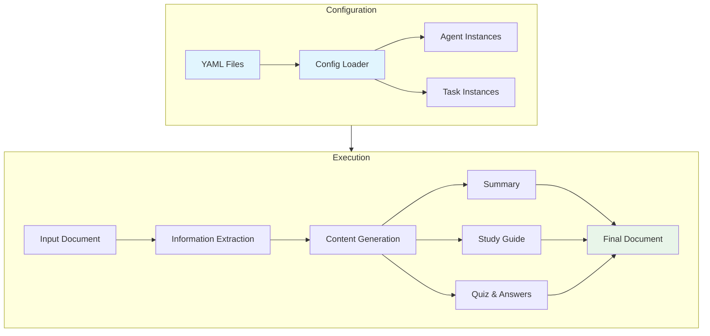

# Document to Quiz Generator via CrewAI

## Overview
This educational project leverages CrewAI to transform documents into interactive quizzes, helping learners engage with and retain information more effectively. It employs a YAML-based configuration system for flexible customization of AI agents and tasks.

## Features
- Convert text documents into comprehensive quiz-style questions
- Generate multiple-choice and open-ended questions with detailed explanations
- Support for various document formats and content types
- YAML-based configuration for easy customization of agents and tasks
- Modular architecture with clean separation of configuration and code
- Automatic generation of summaries, study guides, and structured quizzes
- Built-in monitoring and observability via OpenLIT integration

## Project Structure
```
docs_to_quiz/
├── configs/
│   ├── agents.yaml     # Agent configurations and roles
│   ├── tasks.yaml      # Task definitions and workflows
│   ├── config_loader.py # Configuration loading utilities
│   └── models.py       # Pydantic data models
├── input/              # Input documents
│   └── doc_02_flow_content.md
├── output/            # Generated content
│   ├── summary.md
│   ├── study_guide.md
│   ├── quiz_questions.md
│   ├── quiz_answers.md
│   └── combined_output.md
├── script_01.py       # Main execution script
└── README.md
```

## System Architecture



## Requirements

### Python Dependencies
Key dependencies include:
- `crewai`: AI agent framework for task orchestration
- `pydantic`: Data validation and settings management
- `PyYAML`: YAML configuration parsing
- `openlit`: System monitoring and observability

Install dependencies:
```bash
pip install -r requirements.txt
```

## Configuration

### LLM Configuration
Configure LLM models for different agents:
```yaml
llm_configs:
  gemini_pro:
    model: "openrouter/google/gemini-pro-1.5"
    temperature: 0.7
  
  gpt4:
    model: "openai/gpt-4"
    temperature: 0.5
    
  gpt35_turbo:
    model: "openai/gpt-3.5-turbo"
    temperature: 0.3
```

### Agent Configuration (agents.yaml)
Define AI agents with specific roles and capabilities:
```yaml
extract_agent:
  role: "Information Extractor"
  goal: "To analyze documents and extract key information"
  backstory: "A seasoned researcher with an eye for detail..."
  llm: gemini_pro  # Use Gemini Pro for extraction

writer_agent:
  role: "Content Writer and Educator"
  goal: "To create clear summaries and engaging quizzes"
  backstory: "A skilled educator with expertise..."
  llm: gpt4  # Use GPT-4 for content generation
```

### Task Configuration (tasks.yaml)
Configure tasks with templates and outputs:
```yaml
tasks:
  extract_info:
    description_template: "Extract key information from..."
    expected_output: "A structured dictionary of information..."
    agent: extract_agent

  write_summary:
    description_template: "Create an integrated summary..."
    expected_output: "A markdown formatted summary..."
    agent: writer_agent
```

## Getting Started

### Prerequisites
- Python 3.8+
- Required Python packages (see requirements.txt)
- API keys for chosen LLM providers

### Installation
1. Clone the repository
2. Install dependencies: `pip install -r requirements.txt`
3. Configure environment variables (see below)

### Usage
1. Place your input document in the `input/` directory
2. Configure agents and tasks in `configs/*.yaml` as needed
3. Run the generation script:
```bash
python script_01.py
```
4. Find generated content in the `output/` directory

## Monitoring and Observability
Integrated with OpenLIT for system monitoring:

### OpenLIT Setup
1. Start OpenLIT services:
```bash
docker-compose up -d
```

2. Access dashboard: `http://localhost:3002`

### Environment Variables
Required environment variables:
- `OPENLIT_DB_USER`: Database username
- `OPENLIT_DB_PASSWORD`: Database password
- `OPENLIT_DB_NAME`: Database name
- `LLM_API_KEY`: API key for LLM provider

## Contributing
Contributions welcome! Please submit a Pull Request with your improvements.

## License
MIT License - see LICENSE file for details.