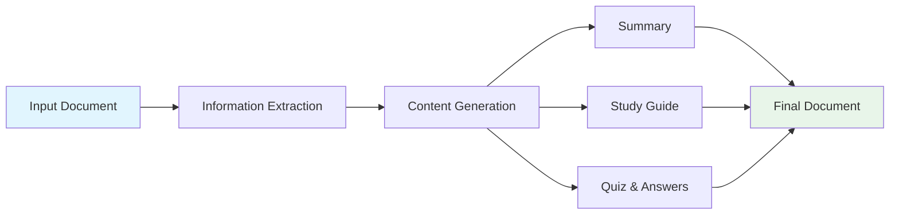

# Document to Quiz Generator via CrewAI

## Overview
This educational project is designed to transform documents into interactive quizzes, helping learners engage with and retain information more effectively.

## Features
- Convert text documents into quiz-style questions
- Generate multiple-choice and open-ended questions
- Support for various document formats

## Project Structure
- `script_01.py`: Main script for generating quizzes
- `output/complete_document.md`: Generated quiz document

## Diagram



## Requirements

### Python Dependencies
The project uses the following key dependencies:
- `crewai` (v0.95.0): AI agent framework
- `crewai-tools` (v0.25.8): Additional tools for CrewAI
- `langchain_community` (v0.3.14): LangChain community integrations
- `openlit` (v1.33.2): Observability and monitoring
- `llama-index` (v0.12.9): Document indexing and retrieval

To install dependencies, run:
```bash
pip install -r requirements.txt
```

### Docker Compose Setup
The project includes a Docker Compose configuration for easy deployment and observability:

#### Services
1. **ClickHouse**: Database for storing observability data
   - Port: 9000, 8123
   - Configurable username and password

2. **OpenLIT**: Observability platform
   - Port: 3002
   - Integrated with ClickHouse for monitoring

3. **OpenTelemetry Collector**: 
   - Collects and processes telemetry data
   - Ports: 4317, 4318, 8889, 55679

#### Running with Docker Compose
```bash
# Ensure Docker and Docker Compose are installed
docker-compose up -d
```

### Environment Variables
Customize the deployment using environment variables:
- `OPENLIT_DB_USER`: Database username (default: `default`)
- `OPENLIT_DB_PASSWORD`: Database password (default: `OPENLIT`)
- `OPENLIT_DB_NAME`: Database name (default: `openlit`)

#### Notes
- Persistent volumes are used for ClickHouse and OpenLIT data
- Services are configured to restart automatically
- Telemetry can be disabled by setting `TELEMETRY_ENABLED` to `false`

## Getting Started

### Prerequisites
- Python 3.8+
- Required Python libraries (install via `pip install -r requirements.txt`)

### Installation
1. Clone the repository
2. Install dependencies: `pip install -r requirements.txt`

### Usage
Run the quiz generation script:
```bash
python script_01.py
```

## Contributing
Contributions are welcome! Please feel free to submit a Pull Request.

## License
This project is for educational purposes.