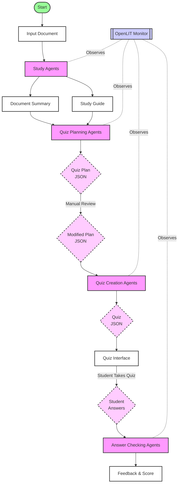

## Goal
- Use CrewAI Agents to summarize a document and guide study
- Use CrewAI Agents to plan quiz
  - breakdown of topics
  - number of questions
  - question types
  - question difficulty
  - output to json file to let user modify
- Use CrewAI Agents to create a quiz according to the plan
- Use CrewAI Agents answer questions and output to json
- User do quiz
- Use CrewAI Agents to check answer and give feedback
- Use OpenLIT to observe agents

## Diagram

## Design

### Section 1: Study Phase
- Goals:
  - Use CrewAI Agents to summarize a document and guide study
- Use Deepseek V3 via LiteLLM - Openrouter
- 'Summarize and study guide' crew